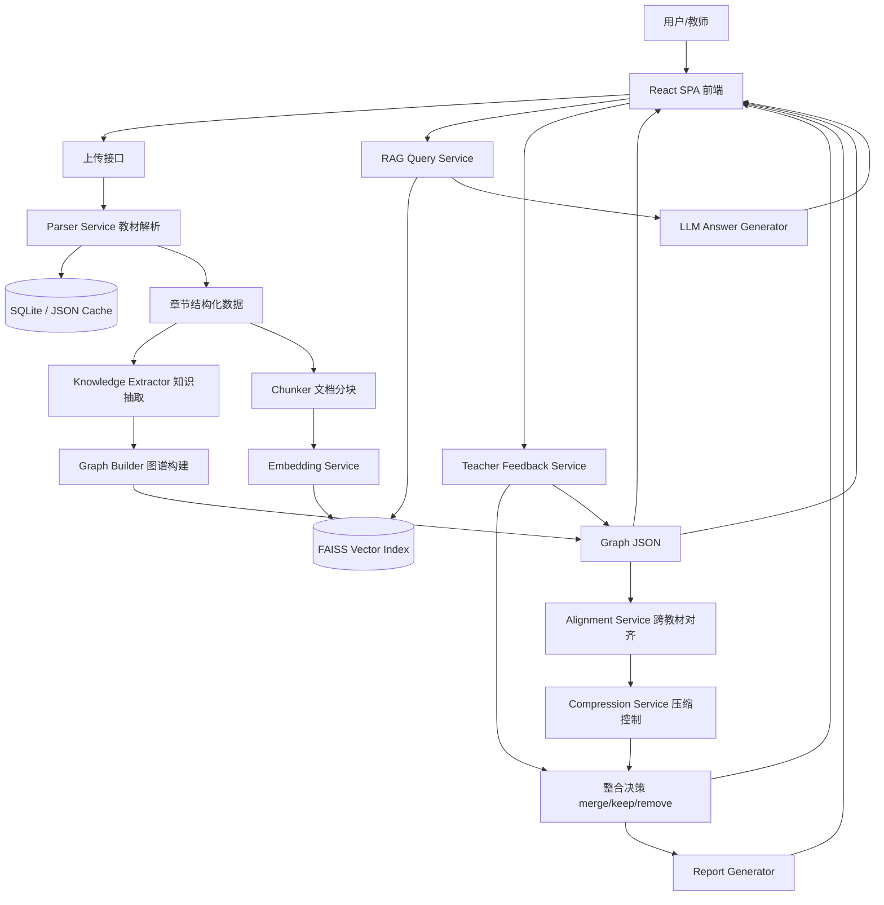

# EduFusion Agent 最终执行方案设计

> 适用项目：浙江大学第一届 AI 全栈极速黑客松「学科知识整合智能体开发」  
> 目标目录：`D:\1Hackathon\docs\plans\最终执行方案设计.md`  
> 方案来源：赛题文档 + Gemini 方案 + Claude 方案 + GPT 研究报告综合归纳  
> 核心原则：**P0 全覆盖、P1 少量高性价比冲分、文档强论证、部署优先、演示闭环稳定。**

---

## 1. 最终结论

本项目最终定位为：

> **EduFusion Agent：面向教师的多教材知识整合、知识图谱可视化与带引用 RAG 问答系统。**

最终不追求在 5 小时内实现一个工业级知识图谱平台，而是要完成一个能被评委完整点击、演示、复现和解释的 Web 应用：

```text
上传多本教材
→ 解析 PDF / Markdown / TXT
→ 识别章节结构
→ LLM 抽取知识点和关系
→ 生成交互式知识图谱
→ 跨教材语义去重与整合
→ 控制整合后内容字数 ≤ 原始总字数 30%
→ 建立 RAG 索引
→ 带教材、章节、页码引用回答问题
→ 教师通过自然语言修改整合决策
→ 自动生成整合报告
```

最终技术路线采用：

```text
FastAPI + React/Vite + TypeScript + ECharts Graph
+ PyMuPDF + Pydantic + LLM API
+ FAISS + BM25 可选 + SQLite/JSON Cache
+ 单主控 Orchestrator + 多工具模块
```

最终架构表述采用：

```text
单主控 Orchestrator Agent + 多 Tool-Agent 模块
```

不采用复杂多 Agent 框架作为主实现，不把 LangGraph、CrewAI、GraphRAG、OCR、大规模聚类、WebSocket 实时推送作为 P0 主线。

---

## 2. 三份方案综合判断

## 2.1 Gemini 方案：技术深度强，适合作为架构和 P2 素材

Gemini 方案强调了：

- 知识图谱融合；
- Embedding 粗筛 + LLM 精判；
- GraphRAG；
- 多 Agent；
- Human-in-the-loop；
- 混合检索与 Rerank；
- 技术论文式论证。

这些内容技术含量高，很适合写进：

```text
docs/Agent架构说明.md
P2 技术报告
未来工作与技术演进章节
```

但在 5 小时比赛中，Gemini 方案整体偏重，若全部实现会带来较高工程风险。

最终采用：

```text
Embedding + LLM 双阶段对齐思想
HITL 教师反馈闭环
混合检索作为 P1
P2 报告中的实验设计思路
```

最终不采用：

```text
复杂多 Agent 强实现
GraphRAG 作为主检索链路
K-Means 大规模语义聚类
WebSocket 实时推送
过重的 G6/Graphin 主实现
```

---

## 2.2 Claude 方案：需求拆解完整，适合形成评分清单

Claude 方案优点是：

- P0 / P1 / P2 拆解清楚；
- 评分维度整理完整；
- 产品布局明确；
- 用户旅程清晰；
- 风险表和时间表可直接复用。

最终采用：

```text
P0/P1/P2 功能分层
左中右三栏产品布局
评分标准映射
用户旅程
风险应对表
```

需要修正的一点：

Claude 方案中有一处将压缩要求表述为“融合后知识点数量 ≤ 原始总量 70%”。最终必须按赛题原文修正为：

> **整合后保留内容总字数不超过原始总字数的 30%。**

因此本项目所有统计口径都以 `char_count` 为核心，不以节点数量作为唯一压缩指标。

---

## 2.3 GPT 研究报告：最贴近 5 小时执行

GPT 研究报告最适合直接落地，核心优点是：

- 强调 P0 功能闭环；
- 推荐 FastAPI + React + ECharts + FAISS + Pydantic；
- 给出 Prompt 模板；
- 给出 API 设计；
- 强调 quick mode；
- 强调“每个模块都要有入口、结果、解释”；
- 强调 Agent 文档论证比 Agent 数量更重要。

最终方案以该思路作为工程主线，并补充来自 Gemini 和 Claude 的深度论证与评分映射。

---

## 3. 回归赛题后的最终目标

赛题要求开发一个学科知识整合智能体，能够：

1. 自动加载多本教材；
2. 为每本教材构建知识图谱并可视化；
3. 跨教材识别知识点重叠、互补与缺失；
4. 将多本教材内容整合压缩到不超过原始体量 30%；
5. 基于整合后的知识库进行 RAG 精准问答，且必须引用原文来源；
6. 自主设计 Agent 架构并提交说明文档；
7. 支持教师通过多轮对话修改整合方案；
8. 提供完整 Web 交互界面；
9. 输出整合报告；
10. 提供完整开发文档和可复现部署说明。

最终项目目标是：

```text
在 5 小时内完成一个可公网访问、可演示、可解释、文档齐全的教材知识整合智能体 MVP。
```

---

## 4. 最终得分策略

## 4.1 主攻分区

评分中最关键的三项：

```text
B. 功能实现完整度：25 分
D. Agent 架构设计：20 分
A. 文档完整性与可复现性：15 分
```

三项合计 60 分，是核心主战场。

图谱可视化、工程规范、创新是拉开分数的区域：

```text
C. 知识图谱可视化创新性：13 分
E. 代码质量与工程规范：17 分
F. 创新与自由发挥：10 分
```

目标分数策略：

| 维度 | 目标分 |
|---|---:|
| A 文档完整性与可复现性 | 12–14 / 15 |
| B 功能实现完整度 | 21–24 / 25 |
| C 图谱可视化创新性 | 8–10 / 13 |
| D Agent 架构设计 | 17–19 / 20 |
| E 代码质量与工程规范 | 12–15 / 17 |
| F 创新与自由发挥 | 4–7 / 10 |
| **总目标** | **85+，发挥好 90+** |

---

## 4.2 必做 P0

P0 是不能妥协的核心闭环。

```text
P0-1  支持 PDF / Markdown / TXT 上传
P0-2  PDF 能解析出章节结构
P0-3  每章能抽取知识点和关系 JSON
P0-4  图谱能在浏览器中渲染
P0-5  图谱支持点击节点、缩放、拖拽、节点详情
P0-6  跨教材生成 merge / keep / remove 决策
P0-7  展示原始总字数、整合后字数、压缩比，且 ≤30%
P0-8  RAG 能建立索引、回答问题、展示引用来源
P0-9  教师对话能修改至少一项整合决策
P0-10 输出 report/整合报告.md
P0-11 提供 README、需求分析、系统设计、Agent 架构说明
P0-12 GitHub 仓库公开且部署链接公网可访问
```

---

## 4.3 高性价比 P1

优先做这些低成本高收益功能：

```text
P1-1 图谱搜索高亮
P1-2 整合前 / 整合后图谱切换
P1-3 BM25 + 向量混合检索
P1-4 .env.example
P1-5 RAG Benchmark 小表格
P1-6 DOCX 支持，如时间足够
P1-7 Docker / docker-compose，如时间足够
```

---

## 4.4 不作为 5 小时主线的功能

```text
复杂多 Agent 自主协作
完整 LangGraph 状态机
GraphRAG 主链路
OCR
扫描版 PDF 识别
完整处理 826MB 全量教材
WebSocket 实时推送
拖拽节点直接合并
PDF 报告导出
大规模 K-Means 聚类
本地开源大模型部署
```

这些内容可以写进“未来工作”或 P2 报告，但不作为主实现路线。

---

## 5. 最终产品设计

## 5.1 产品名称

```text
EduFusion Agent
学科知识融合智能体
```

## 5.2 页面总体布局

采用单页应用 SPA，三栏式布局：

```text
┌──────────────────────────────────────────────────────────────────┐
│ 顶栏：EduFusion Agent | 已上传 X 本 | 已解析 X 本 | 已索引 X chunks │
├───────────────┬──────────────────────────────┬───────────────────┤
│ 左侧教材管理区 │ 中间知识图谱画布              │ 右侧功能面板       │
│               │                              │                   │
│ 上传文件       │ ECharts Graph                │ Tab 1 节点详情     │
│ 文件列表       │ 节点大小 = 频次               │ Tab 2 整合决策     │
│ 解析状态       │ 节点颜色 = 教材来源           │ Tab 3 RAG 问答     │
│ 章节树         │ 缩放 / 拖拽 / 点击 / 搜索     │ Tab 4 教师对话     │
│ 操作按钮       │ 整合前 / 后切换               │ Tab 5 报告预览     │
└───────────────┴──────────────────────────────┴───────────────────┘
```

---

## 5.3 左侧：教材管理区

功能组件：

```text
1. 拖拽上传区域
2. 点击选择文件
3. 文件列表
4. 文件格式、大小、解析状态
5. 章节树
6. 快捷操作按钮
```

按钮顺序：

```text
上传教材
解析教材
生成图谱
跨教材整合
建立 RAG 索引
生成报告
```

文件卡片示例：

```text
病理学.pdf
格式：PDF
大小：128 MB
状态：已解析
章节：12
字数：385000
```

---

## 5.4 中间：知识图谱画布

图谱必须体现：

```text
节点颜色：教材来源
节点大小：出现频次
节点边框：raw / merged / kept / removed 状态
边标签：prerequisite / contains / parallel / applies_to
```

基础交互：

```text
缩放
拖拽画布
拖拽节点
点击节点
搜索高亮
整合前 / 整合后切换
```

---

## 5.5 右侧：功能面板

### Tab 1：节点详情

显示：

```text
知识点名称
定义
类别
教材来源
章节
页码
原文短引用
出现频次
关联节点
当前状态：raw / merged / kept / removed
```

### Tab 2：整合决策

显示：

```text
原始总字数
整合后字数
压缩比
整合前节点数
整合后节点数
merge 数量
keep 数量
remove 数量
决策列表
```

决策卡片示例：

```text
merge_001
动作：merge
涉及节点：炎症 / 炎症反应 / inflammation
结果节点：炎症
置信度：0.91
原因：三个节点均描述机体对损伤因子的防御反应，因此合并。
按钮：撤销合并 / 保留 / 删除 / 查看来源
```

### Tab 3：RAG 问答

展示：

```text
问题输入框
答案正文
引用来源列表
相关度分数
点击展开原文 chunk
```

引用格式：

```text
[病理学, 第四章 炎症, 第78页]
```

### Tab 4：教师对话

支持输入：

```text
为什么合并“炎症”和“炎症反应”？
我觉得“免疫应答”不应该被删除，请保留。
把“抗原”和“免疫原”分开，它们不是同一个概念。
```

系统返回：

```text
已将“免疫应答”的整合决策从 remove 修改为 keep，并更新图谱。
```

### Tab 5：报告预览

展示 Markdown 报告：

```text
整合概览
整合决策摘要
知识图谱统计
重点整合案例
教学完整性说明
```

---

## 6. 最终技术路线

## 6.1 技术栈选择

| 层级 | 最终选择 | 理由 |
|---|---|---|
| 后端 | FastAPI | Python AI 生态成熟，接口开发快，自带 Swagger 文档 |
| 数据校验 | Pydantic | 校验 LLM JSON 输出，降低格式崩溃风险 |
| 前端 | React + Vite + TypeScript | 快速构建 SPA，组件化清晰 |
| UI | Ant Design 或 Tailwind | 快速搭建左右中布局 |
| 图谱 | ECharts Graph | 出图快，支持 graph、缩放、拖拽、点击 |
| PDF 解析 | PyMuPDF | 逐页解析，性能好，适合保留页码 |
| MD/TXT 解析 | Python 原生读取 | 简单稳定 |
| DOCX 解析 | python-docx，可选 | P1 加分 |
| 向量库 | FAISS | 轻量，本地运行快 |
| 稀疏检索 | rank-bm25，可选 | 实现混合检索，低成本加分 |
| Embedding | BGE-small-zh / multilingual-MiniLM / API Embedding | 支持中文语义检索 |
| LLM | OpenAI-compatible adapter | 可接 DeepSeek、通义、OpenAI 等 |
| 存储 | SQLite + JSON cache | 轻量、易调试、易部署 |
| 部署 | FastAPI 一体化托管前端 build 或前后端分离 | 以公网可访问为最高优先级 |

---

## 6.2 为什么不用复杂多 Agent 作为主线

赛题明确不强制多 Agent，评分看设计决策合理性，不看 Agent 数量。

因此最终采用：

```text
单主控 Orchestrator + 多工具模块
```

不采用：

```text
CrewAI / AutoGen / LangGraph 复杂多 Agent 主实现
```

原因：

```text
1. 5 小时内稳定性比框架复杂度更重要。
2. 本赛题主流程是确定性线性工作流：解析 → 抽取 → 图谱 → 整合 → RAG → 反馈。
3. 固定 workflow 比自由协作型多 Agent 更容易调试和演示。
4. 每个模块都可定义为 Tool-Agent，满足 Agent 架构说明要求。
5. 后续可在文档中说明可升级为 LangGraph 多 Agent 状态图。
```

最终 Agent 架构：

```text
Orchestrator Agent
├── Parser Tool-Agent
├── Knowledge Extraction Tool-Agent
├── Graph Builder Tool-Agent
├── Alignment & Compression Tool-Agent
├── RAG QA Tool-Agent
├── Teacher Feedback Tool-Agent
└── Report Tool-Agent
```

---

## 7. 最终系统架构



---

## 8. 数据流设计

```text
用户上传教材
→ 文件解析为 Textbook + Chapter
→ Chapter 进入 LLM 抽取 nodes + edges
→ Graph Builder 生成单本图谱
→ 多本图谱进入 Alignment
→ 生成 merge / keep / remove 决策
→ Compression 控制整合后字数 ≤ 原始总字数 30%
→ Chunker 对教材正文分块
→ Embedding 建立 FAISS 索引
→ RAG 基于 top-5 chunks 生成带引用回答
→ 教师反馈修改决策
→ 图谱、报告、RAG 状态更新
```

---

## 9. 核心数据模型

### 9.1 Textbook

```json
{
  "textbook_id": "book_01",
  "filename": "病理学.pdf",
  "title": "病理学",
  "file_type": "pdf",
  "total_pages": 520,
  "total_chars": 385000,
  "status": "parsed",
  "chapters": []
}
```

### 9.2 Chapter

```json
{
  "chapter_id": "book_01_ch_04",
  "textbook_id": "book_01",
  "title": "第四章 炎症",
  "page_start": 78,
  "page_end": 96,
  "content": "炎症是具有血管系统的活体组织对各种损伤因子所发生的防御反应……",
  "char_count": 14200
}
```

### 9.3 KnowledgeNode

```json
{
  "id": "book_01_ch_04_n_001",
  "textbook_id": "book_01",
  "name": "炎症",
  "aliases": ["炎症反应", "inflammation"],
  "definition": "活体组织对损伤因子的防御反应",
  "category": "核心概念",
  "chapter": "第四章 炎症",
  "page": 78,
  "source_quote": "炎症是具有血管系统的活体组织对各种损伤因子所发生的防御反应",
  "frequency": 1,
  "status": "raw"
}
```

### 9.4 KnowledgeEdge

```json
{
  "source": "book_01_ch_04_n_001",
  "target": "book_01_ch_04_n_002",
  "relation_type": "contains",
  "description": "炎症包含血管反应和细胞反应",
  "textbook_id": "book_01"
}
```

### 9.5 MergeDecision

```json
{
  "decision_id": "merge_001",
  "action": "merge",
  "affected_nodes": [
    "book_01_ch_04_n_001",
    "book_02_ch_09_n_003"
  ],
  "result_node": "merged_n_001",
  "reason": "两个节点均描述炎症这一核心概念，定义语义高度一致，因此合并。",
  "confidence": 0.91,
  "status": "active"
}
```

### 9.6 RAGChunk

```json
{
  "chunk_id": "book_01_ch_04_ck_003",
  "textbook_id": "book_01",
  "textbook": "病理学",
  "chapter": "第四章 炎症",
  "page_start": 78,
  "page_end": 79,
  "content": "炎症是具有血管系统的活体组织对各种损伤因子所发生的防御反应……",
  "char_count": 620
}
```

---

## 10. 核心功能模块设计

## 10.1 教材解析模块

输入：

```text
PDF / Markdown / TXT
```

输出：

```text
Textbook + Chapter[]
```

实现策略：

```text
PDF：PyMuPDF 逐页提取文本
MD/TXT：直接读取
章节识别：正则 + 简单标题规则
页码保留：每页文本带 page metadata
```

章节识别正则：

```python
patterns = [
    r"第[一二三四五六七八九十百0-9]+章\s*[^\n]{0,40}",
    r"第[一二三四五六七八九十百0-9]+节\s*[^\n]{0,40}",
    r"Chapter\s+\d+[:：\s]?.*",
    r"^\d+(\.\d+)*\s+[^\n]{2,40}$"
]
```

兜底策略：

```text
如果章节识别失败：
1. 按每 10 页生成一个虚拟章节；或
2. 整本书作为“默认章节”。
```

不做：

```text
OCR
复杂版面还原
图表内容识别
```

---

## 10.2 知识点抽取模块

输入：

```text
单个章节内容
```

输出：

```text
nodes[] + edges[]
```

策略：

```text
每章最多处理前 3000–5000 字
每章抽取 5–10 个节点
每章生成 5–15 条边
关系类型至少覆盖 3 种：
prerequisite / parallel / contains / applies_to
```

LLM 输出校验：

```text
LLM → JSON → Pydantic 校验 → repair prompt → 规则兜底
```

---

## 10.3 图谱可视化模块

图谱字段映射：

```text
节点颜色 = 教材来源
节点大小 = frequency
节点边框 = merged / removed / kept 状态
边标签 = relation_type
```

交互：

```text
缩放
拖拽
点击节点
搜索高亮
整合前后切换
```

技术实现：

```text
React ECharts
series.type = graph
layout = force
roam = true
draggable = true
```

---

## 10.4 跨教材整合模块

输入：

```text
多本教材的 KnowledgeNode[]
```

输出：

```text
MergeDecision[]
MergedGraph
CompressionStats
```

最终算法：

```text
1. 节点文本归一化
2. 对 name + definition 生成 embedding
3. 计算节点两两相似度
4. 根据阈值生成候选簇
5. 并查集合并等价节点
6. 每个簇生成 merge 决策
7. 未合并节点生成 keep 决策
8. 合并中被吸收节点标记 remove
9. 生成 merged_node
10. 控制总字数 ≤ 原始总字数 30%
```

阈值建议：

```text
名称完全一致 / alias 命中：直接候选
cosine similarity ≥ 0.90：自动 merge
0.82 ≤ similarity < 0.90：LLM 判断，或标记 need_review
similarity < 0.82：keep
```

合并节点生成优先级：

```text
1. 定义更完整
2. 来源更多
3. 连接度更高
4. 出现频次更高
5. 页码和章节信息更明确
```

---

## 10.5 压缩比控制模块

赛题要求：

```text
整合后保留内容总字数 ≤ 原始总字数 30%
```

最终计算方式：

```text
original_chars = 所有章节 content 的 char_count 总和

compressed_chars =
    所有 merged/kept 节点 definition 字数
  + 每个核心知识点代表性 source_quote 字数
  + 少量代表性 chunk 字数

compression_ratio = compressed_chars / original_chars * 100
```

目标不是刚好 30%，而是控制在：

```text
25%–28%
```

如果超过 30%，自动执行：

```text
1. 删除低频 remove 节点
2. 缩短 definition 到 120 字以内
3. 每个知识点只保留 1 条 source_quote
4. 删除低重要性 chunk
5. 保留 prerequisite 链路上的节点
```

重要性评分：

```text
importance =
  0.35 * frequency
+ 0.25 * graph_degree
+ 0.20 * chapter_weight
+ 0.20 * citation_support
```

教学完整性保障：

```text
前置依赖链上的节点不删
高频核心节点不删
被删除节点保留来源和恢复按钮
教师可以通过对话恢复
```

---

## 10.6 RAG 模块

Chunking 参数：

```text
chunk_size = 600 字
overlap = 80 字
top_k = 5
```

这完全落在赛题要求的：

```text
500–800 字 chunk
50–100 字 overlap
```

Chunk 元数据：

```json
{
  "textbook": "病理学",
  "chapter": "第四章 炎症",
  "page_start": 78,
  "page_end": 79,
  "content": "……"
}
```

基础检索：

```text
FAISS dense retrieval top-5
```

P1 检索：

```text
FAISS top-8 + BM25 top-8
→ 合并去重
→ 线性重排
→ top-5
```

重排公式：

```text
score = 0.7 * vector_score + 0.3 * bm25_score
```

生成约束：

```text
只能基于上下文回答
必须引用教材 / 章节 / 页码
找不到就回答“当前知识库中未找到相关信息”
```

---

## 10.7 教师反馈模块

输入：

```text
自然语言
```

支持意图：

```text
explain：解释决策
keep：保留知识点
remove：删除知识点
merge：合并知识点
split：拆分知识点
```

实现策略：

```text
先规则，后 LLM
```

规则示例：

```text
包含“为什么” → explain
包含“保留” → keep
包含“删除” → remove
包含“合并” → merge
包含“分开 / 拆开 / 不应该合并” → split
```

状态更新：

```text
教师输入
→ 解析 intent 和 target
→ 修改 MergeDecision
→ 更新节点 status
→ 重新生成 merged_graph
→ 前端刷新图谱和决策列表
```

验收目标：

```text
能修改至少一项整合决策
修改后图谱或决策列表有可见变化
同会话保留对话历史
```

---

## 10.8 报告模块

自动生成：

```text
report/整合报告.md
```

必须包含：

```text
1. 整合概览
2. 决策摘要
3. 知识图谱统计
4. 重点整合案例 3–5 个
5. 教学完整性说明
```

报告数字从当前系统状态自动填充，避免与系统实际结果不一致。

---

## 11. API 设计

### 教材接口

```http
POST /api/textbooks/upload
GET  /api/textbooks
POST /api/textbooks/{textbook_id}/parse
GET  /api/textbooks/{textbook_id}
```

### 图谱接口

```http
POST /api/graph/build
GET  /api/graph
GET  /api/graph/merged
```

### 整合接口

```http
POST  /api/integration/run
GET   /api/integration/decisions
PATCH /api/integration/decisions/{decision_id}
```

### RAG 接口

```http
POST /api/rag/index
GET  /api/rag/status
POST /api/rag/query
```

### 教师反馈接口

```http
POST /api/chat
GET  /api/chat/history
```

### 报告接口

```http
GET  /api/report
POST /api/report/generate
```

---

## 12. Prompt 模板

### 12.1 知识抽取 Prompt

```text
你是教材知识图谱抽取专家。请从给定章节中抽取核心知识点和知识点关系。

必须遵守：
1. 只输出合法 JSON，不要输出 Markdown。
2. 只基于给定正文，不得使用外部知识。
3. nodes 中每个对象必须包含：
   id, name, definition, category, chapter, page, source_quote
4. edges 中每个对象必须包含：
   source, target, relation_type, description
5. relation_type 只能是：
   prerequisite, parallel, contains, applies_to
6. 最多输出 10 个节点、15 条边。
7. definition 不超过 80 字。
8. source_quote 必须是原文中的短句。

教材名：{book_title}
章节名：{chapter_title}
起始页：{page_start}

正文：
{chapter_content}

输出：
{
  "nodes": [],
  "edges": []
}
```

### 12.2 合并判断 Prompt

```text
你是跨教材知识点对齐专家。请判断两个知识点是否表示同一概念。

判断原则：
1. 同义词、中英文术语、不同表达但定义等价，可以合并。
2. 上下位概念不能合并。
3. 应用场景相同但概念不同，不能合并。
4. 如果证据不足，输出 need_review=true。
5. 只输出 JSON。

知识点 A：
名称：{name_a}
定义：{definition_a}
教材：{book_a}
章节：{chapter_a}

知识点 B：
名称：{name_b}
定义：{definition_b}
教材：{book_b}
章节：{chapter_b}

向量相似度：{similarity}

输出：
{
  "equivalent": true,
  "decision": "merge",
  "confidence": 0.0,
  "reason": "",
  "need_review": false
}
```

### 12.3 RAG 问答 Prompt

```text
你是严格基于教材内容回答问题的教学助手。

规则：
1. 只能使用下方提供的教材片段回答。
2. 不得使用外部知识。
3. 如果上下文不足，请回答：“当前知识库中未找到相关信息”。
4. 每个关键结论都必须附引用。
5. 引用格式为：[教材名称, 章节, 第X页]。
6. 只输出 JSON。

用户问题：
{question}

教材片段：
{retrieved_chunks}

输出：
{
  "answer": "",
  "citations": [
    {
      "textbook": "",
      "chapter": "",
      "page": 0,
      "quote": ""
    }
  ]
}
```

### 12.4 教师反馈 Prompt

```text
你是教材整合决策助手。请把教师的自然语言反馈解析成结构化操作。

操作类型：
- explain：解释某项决策
- keep：保留某知识点
- remove：删除某知识点
- merge：合并多个知识点
- split：拆分已合并知识点
- unknown：无法判断

只输出 JSON。

教师输入：
{teacher_message}

当前决策摘要：
{decision_list_summary}

输出：
{
  "intent": "",
  "target_names": [],
  "decision_id": null,
  "reason": "",
  "requires_graph_update": false
}
```

---

## 13. 项目目录设计

```text
edufusion-agent/
├── README.md
├── requirements.txt
├── package.json
├── .env.example
├── .gitignore
├── docker-compose.yml                 # 有时间则做
├── docs/
│   ├── 需求分析.md
│   ├── 系统设计.md
│   ├── Agent架构说明.md
│   ├── 接口文档.md
│   └── plans/
│       └── 最终执行方案设计.md
├── report/
│   └── 整合报告.md
├── backend/
│   ├── main.py
│   ├── config.py
│   ├── schemas.py
│   ├── routers/
│   │   ├── textbooks.py
│   │   ├── graph.py
│   │   ├── integration.py
│   │   ├── rag.py
│   │   ├── chat.py
│   │   └── report.py
│   ├── services/
│   │   ├── parser_service.py
│   │   ├── extractor_service.py
│   │   ├── graph_service.py
│   │   ├── alignment_service.py
│   │   ├── compression_service.py
│   │   ├── rag_service.py
│   │   ├── chat_service.py
│   │   └── report_service.py
│   ├── prompts/
│   │   ├── extract_knowledge.txt
│   │   ├── merge_judge.txt
│   │   ├── rag_answer.txt
│   │   └── feedback_parse.txt
│   └── storage/
│       ├── uploads/
│       ├── parsed/
│       ├── graphs/
│       ├── vectors/
│       └── reports/
└── frontend/
    ├── index.html
    ├── vite.config.ts
    └── src/
        ├── App.tsx
        ├── api/
        ├── components/
        │   ├── UploadPanel.tsx
        │   ├── TextbookList.tsx
        │   ├── GraphView.tsx
        │   ├── NodeDetailPanel.tsx
        │   ├── IntegrationPanel.tsx
        │   ├── RagPanel.tsx
        │   ├── ChatPanel.tsx
        │   └── ReportPanel.tsx
        └── types/
```

`.gitignore` 必须包含：

```gitignore
*.pdf
data/textbooks/*.pdf
backend/storage/uploads/*
backend/storage/vectors/*
.env
__pycache__/
node_modules/
dist/
```

---

## 14. 5 小时最终排期

## 14.1 0–20 分钟：项目骨架

产出：

```text
FastAPI 启动
React/Vite 启动
CORS 配置
.env.example
目录结构
```

---

## 14.2 20–55 分钟：上传与解析

产出：

```text
上传 PDF / MD / TXT
文件列表
解析状态
章节结构 JSON
章节树展示
```

必须通过：

```text
上传 1 个 PDF 后能显示章节列表
```

---

## 14.3 55–105 分钟：知识抽取与图谱 JSON

产出：

```text
LLM 抽取 nodes / edges
Pydantic 校验
失败兜底
Graph JSON 接口
```

必须通过：

```text
至少一本教材生成节点和边
关系类型至少 3 种
```

---

## 14.4 105–145 分钟：图谱可视化

产出：

```text
ECharts Graph
节点颜色区分教材
节点大小表示频次
点击节点显示详情
搜索高亮
```

必须通过：

```text
图谱能缩放、拖拽、点击
```

---

## 14.5 145–190 分钟：跨教材整合

产出：

```text
Embedding 相似度
merge / keep / remove
决策理由
压缩比统计
整合后图谱
```

必须通过：

```text
2 本教材以上能生成整合决策
压缩比 ≤30%
```

---

## 14.6 190–230 分钟：RAG

产出：

```text
Chunking
FAISS 索引
RAG status
RAG query
答案 + citations + source_chunks
```

必须通过：

```text
提问后返回带教材 / 章节 / 页码引用的答案
```

---

## 14.7 230–250 分钟：教师反馈

产出：

```text
聊天界面
规则解析 keep / split / explain
修改决策
刷新图谱或决策列表
```

必须通过：

```text
输入“请保留 XXX”后，remove 改为 keep
```

---

## 14.8 250–280 分钟：文档

优先级：

```text
1. docs/Agent架构说明.md
2. README.md
3. docs/需求分析.md
4. docs/系统设计.md
5. report/整合报告.md
```

---

## 14.9 280–300 分钟：部署与彩排

检查：

```text
公网链接能打开
GitHub 仓库 public
.env 不泄露
PDF 没上传
上传流程可用
RAG 能回答
图谱能展示
报告存在
```

---

## 15. 最终演示脚本

比赛现场建议按这个顺序演示：

```text
1. 打开系统首页。
2. 上传 2 本教材。
3. 展示文件状态：解析中 → 已完成。
4. 展示章节树。
5. 点击“生成知识图谱”。
6. 中间图谱出现。
7. 搜索“炎症”或任意知识点。
8. 点击节点，右侧显示定义、章节、页码、来源。
9. 点击“跨教材整合”。
10. 展示 merge / keep / remove 决策。
11. 展示压缩比 ≤30%。
12. 切到 RAG，提问“炎症是什么？”。
13. 展示答案和引用来源。
14. 点击引用，展开原文 chunk。
15. 切到教师对话，输入“我觉得 XXX 不应该删除，请保留”。
16. 展示决策从 remove 改为 keep。
17. 切到报告，展示整合报告。
18. 打开 README 或 Swagger /docs。
```

---

## 16. 文档写法要求

## 16.1 docs/Agent架构说明.md

必须重点写：

```text
1. 架构总览
2. 为什么选择单主控 Orchestrator + 多工具模块
3. 每个 Tool-Agent 职责
4. 上传 → 图谱 → 整合 → RAG → 反馈的数据流
5. Prompt 工程
6. RAG Pipeline 设计
7. 替代方案与取舍
8. 局限性与未来改进
9. 创新点
```

核心论证：

```text
不使用复杂多 Agent，是因为 5 小时比赛中，确定性 workflow 更可控。
系统仍具备 Agent 化能力：每个模块有明确目标、输入输出、工具调用和状态更新。
```

---

## 16.2 docs/需求分析.md

必须覆盖：

```text
知识点粒度定义
重复判定标准
压缩比计算方式
教学连贯性保障
RAG 分块依据
教师反馈场景
```

---

## 16.3 docs/系统设计.md

必须覆盖：

```text
架构图
数据模型
API 接口
模块职责
技术选型理由
部署方案
```

---

## 16.4 report/整合报告.md

模板：

```markdown
# 教材知识整合报告

## 1. 整合概览
- 原始教材数量：
- 原始总字数：
- 整合后字数：
- 压缩比：
- 是否满足 30%：

## 2. 整合决策摘要
- merge：
- keep：
- remove：

## 3. 知识图谱统计
- 整合前节点数：
- 整合后节点数：
- 整合前关系数：
- 整合后关系数：

## 4. 重点整合案例
### 案例 1：XXX
- 涉及教材：
- 决策：
- 理由：
- 置信度：

## 5. 教学完整性说明
说明如何保留前置依赖链、核心高频节点和教师可恢复机制。
```

---

## 17. 风险与兜底

| 风险 | 兜底 |
|---|---|
| PDF 解析失败 | 显示错误；用 MD/TXT 或默认章节兜底 |
| 章节识别失败 | 按页数切成虚拟章节 |
| LLM JSON 不合法 | Pydantic 校验 + repair prompt + 规则兜底 |
| LLM API 超时 | quick mode，只处理前几章 |
| Embedding 模型下载失败 | API embedding 或 TF-IDF 兜底 |
| 图谱太密 | 默认只展示高频节点 |
| RAG 答案无引用 | 强制 citations 字段，不通过校验就重新生成 |
| 压缩比超过 30% | 自动裁剪低重要性节点和 source_quote |
| 教师反馈无法理解 | 返回可选操作按钮：保留 / 删除 / 拆分 |
| 部署失败 | FastAPI 一体化托管 React build，减少服务数 |

---

## 18. 最终取舍清单

## 18.1 采用

```text
FastAPI
React + Vite
ECharts Graph
PyMuPDF
Pydantic
FAISS
BM25 可选
OpenAI-compatible LLM adapter
SQLite + JSON cache
单主控 Orchestrator + 多工具模块
```

## 18.2 不采用为主线

```text
复杂 LangGraph 多 Agent
GraphRAG 主链路
OCR
K-Means 大规模聚类
完整 WebSocket 实时推送
完整 7 本教材全量精处理
```

## 18.3 写进未来工作

```text
GraphRAG
多视图图谱
拖拽合并
Rerank 模型
Docker 完整部署
P2 技术报告
OCR 支持
本地开源大模型
```

---

## 19. 最终执行原则

这次比赛真正要赢，不是靠单点算法炫技，而是靠：

```text
1. 功能闭环完整
2. 每个验收点都有界面入口
3. 每个结果都有结构化数据
4. 每个决策都有理由
5. 每个回答都有引用
6. 每个文档都能解释取舍
7. 部署链接能打开
```

最终一句话方案：

> 用 FastAPI + React + ECharts + FAISS 快速实现一个稳定的“教材上传解析—知识图谱—语义整合—RAG 问答—教师反馈—整合报告”闭环系统；架构上采用单主控 Orchestrator + 多工具模块，在文档中充分论证取舍，优先覆盖 P0，再用搜索高亮、混合检索、Benchmark 和 `.env.example` / Docker 等轻量 P1 冲分。

---

## 20. 最终检查清单

提交前逐项检查：

```text
[ ] GitHub 仓库为 Public
[ ] 有公网部署链接
[ ] README.md 存在且能按步骤运行
[ ] docs/需求分析.md 存在
[ ] docs/系统设计.md 存在
[ ] docs/Agent架构说明.md 存在
[ ] docs/plans/最终执行方案设计.md 存在
[ ] report/整合报告.md 存在
[ ] .env.example 存在
[ ] .gitignore 排除了 PDF 和上传目录
[ ] PDF / MD / TXT 可上传
[ ] PDF 能显示章节结构
[ ] 能生成知识图谱
[ ] 图谱能点击节点查看详情
[ ] 跨教材整合能生成 merge / keep / remove
[ ] 压缩比显示且 ≤30%
[ ] RAG 能返回带引用答案
[ ] 教师对话能修改至少一项决策
[ ] 报告数据与系统实际状态一致
[ ] 部署链接已在另一台设备或无缓存浏览器中测试
```

