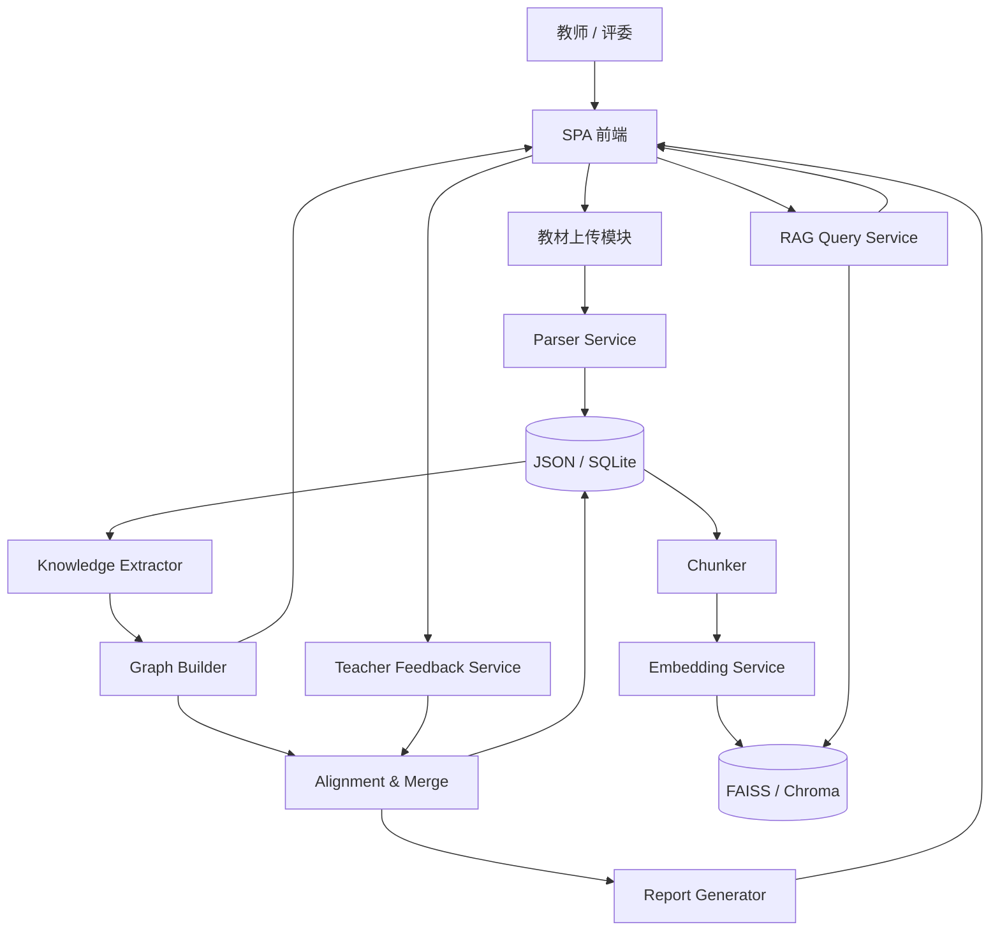

# 浙江大学五小时黑客松赛题深度分析报告

## 执行摘要

这道题的本质，不是做一个“功能很多但彼此松散”的 AI Demo，而是要在 **5 小时**内交付一个可上线、可演示、可复现、可解释的单页 Web 系统：上传多本教材，解析 PDF/MD/TXT，抽取知识点并生成交互式知识图谱，跨教材语义对齐与去重整合，将保留内容控制在原始体量的 **30% 以内**，同时支持带原文引用的 RAG 问答、教师反馈修正以及 Agent 架构说明文档。赛题把这些都写成了明确的 P0 功能与验收口径。fileciteturn0file0

从评分结构看，最高优先级不是“炫技”，而是 **功能完整度 25 分 + Agent 架构设计 20 分 + 文档完整性与可复现性 15 分**，三项合计 **60 分**；再叠加图谱交互与工程规范，就已经决定大部分排名。赛题还明确给出“基础满分（P0）62 分、含 P1 为 90 分、总满分 100 分，P2 为额外加分”的结构，这意味着 **先跑通 P0、再补少量高性价比 P1**，远比上来堆复杂多 Agent 更稳。fileciteturn0file0

在技术路线方面，最适合 5 小时比赛的主栈是：entity["software","FastAPI","Python API web framework"] 负责后端接口与自动交互式 API 文档，entity["software","PyMuPDF","Python PDF processing library"] 负责逐页文本提取与 PDF 预处理，entity["software","Apache ECharts","browser charting and graph visualization library"] 负责关系图可视化，entity["software","FAISS","dense vector similarity search library"] 负责知识点相似检索与 RAG 向量检索，entity["software","Pydantic","Python data validation library"] 负责 LLM 输出校验与 JSON Schema 约束。FastAPI 官方文档强调其基于 Python 类型提示、性能高、默认提供 Swagger UI / ReDoc；PyMuPDF 官方文档强调其高性能文本抽取能力，并支持 `Page.get_text(..., sort=True)` 以及表格检测；FAISS 官方文档强调其强项是 dense vector 的相似检索与聚类；ECharts 官方文档说明其包含 graph series，且支持 Canvas/SVG 与大规模数据渲染；Pydantic 官方文档说明其支持严格校验与 JSON Schema 生成。citeturn4search3turn4search6turn4search10turn0search5turn4search2turn0search1turn0search6turn0search7turn4search17turn6search2turn5search7

架构上，赛题并 **不强制多 Agent**，而是强调“评分不看 Agent 数量，看设计决策合理性”。结合比赛时长，最稳方案不是复杂多 Agent，而是 **单主控 Orchestrator + 多工具模块**：Parser、Extractor、Graph Builder、Aligner、RAG、Feedback、Report。LangGraph 官方文档将 workflow 定义为“预定代码路径、按顺序运行”，而 agent 更动态；在 5 小时内，这恰好说明为什么**固定工作流 + 清晰状态流**比自由协作型多 Agent 更适合黑客松。fileciteturn0file0 citeturn5search0turn5search12turn5search16

如果只给一句结论：**先做“上传—解析—图谱—整合—RAG—对话—报告”的闭环，再追求“混合检索、Rerank、Benchmark、多视图图谱、Docker”等冲分项。** 评审最看重的是“每个要求都能点开、能解释、能对应文档和数据”，而不是单点算法的理论优雅。fileciteturn0file0

## 可直接复制到项目中的 Prompt 模板清单

以下四类 Prompt 直接对应赛题对 **知识点抽取、跨教材合并判断、带引用 RAG 问答、教师反馈修正** 的要求。建议所有模型输出都先经过 entity["software","Pydantic","Python data validation library"] 严格校验；若首轮 JSON 不合法，则进入“一次 repair loop + 一次兜底规则”的双层修复。赛题要求 JSON 输出、RAG 引用格式与教师反馈修改；Pydantic 文档则支持类型校验、严格模式与 JSON Schema 生成。fileciteturn0file0 citeturn6search2turn6search7turn5search7

### 知识点抽取 Prompt

```text
你是教材知识图谱抽取专家。请从给定章节中抽取核心知识点与知识关系。

必须遵守：
1. 只输出合法 JSON，不要输出 Markdown，不要解释。
2. 只基于给定内容，不得补充外部知识。
3. nodes 中每个对象必须包含：
   id, name, definition, category, chapter, page, source_quote
4. edges 中每个对象必须包含：
   source, target, relation_type, description
5. relation_type 只能从以下四种中选择：
   prerequisite, parallel, contains, applies_to
6. 本次最多输出 10 个节点、15 条边。
7. definition 不超过 80 字；source_quote 必须是原文短引文。

输入：
教材名：{book_title}
章节名：{chapter_title}
起始页：{page_start}
正文：
{chapter_content}

输出 JSON：
{
  "nodes": [],
  "edges": []
}
```

**示例输入**

```text
教材名：病理学
章节名：第四章 炎症
起始页：78
正文：炎症是具有血管系统的活体组织对各种损伤因子所发生的防御反应……
```

**示例输出**

```json
{
  "nodes": [
    {
      "id": "book01_ch04_n01",
      "name": "炎症",
      "definition": "活体组织对损伤因子的防御反应",
      "category": "核心概念",
      "chapter": "第四章 炎症",
      "page": 78,
      "source_quote": "炎症是具有血管系统的活体组织对各种损伤因子所发生的防御反应"
    }
  ],
  "edges": []
}
```

### 合并判断 Prompt

```text
你是跨教材知识点对齐专家。请判断两个知识点是否应视为“同一概念”。

判断原则：
1. 同义词、中英文术语、不同表述但定义等价，可判定为同一概念。
2. 上下位概念不能直接合并。
3. 应用场景关系不能误判成同义。
4. 如证据不足，输出 need_review。
5. 只输出 JSON。

输入：
知识点A：
{name_a}
定义A：{definition_a}
教材A：{book_a}
章节A：{chapter_a}

知识点B：
{name_b}
定义B：{definition_b}
教材B：{book_b}
章节B：{chapter_b}

向量相似度：{similarity}

输出 JSON：
{
  "equivalent": true,
  "decision": "merge",
  "confidence": 0.0,
  "reason": "",
  "need_review": false
}
```

**示例输入**

```text
知识点A：白细胞
定义A：参与免疫与炎症反应的血细胞
教材A：生理学
章节A：第九章 免疫

知识点B：leukocyte
定义B：在炎症和免疫过程中发挥作用的血细胞
教材B：病理学
章节B：第四章 炎症

向量相似度：0.91
```

**示例输出**

```json
{
  "equivalent": true,
  "decision": "merge",
  "confidence": 0.93,
  "reason": "名称为中英文对应，定义语义一致，均指参与免疫和炎症过程的血细胞",
  "need_review": false
}
```

### RAG 问答 Prompt

```text
你是教材问答助手。你只能依据给定教材片段回答。

规则：
1. 只能使用上下文，不得使用外部知识。
2. 若上下文不足，回答：当前知识库中未找到相关信息。
3. 每个关键结论后都要附引用，格式：
   [教材名称, 章节, 第X页]
4. 先给回答，再给 citations 数组。
5. 只输出 JSON。

用户问题：
{question}

上下文：
{retrieved_chunks}

输出：
{
  "answer": "",
  "citations": [
    {
      "textbook": "",
      "chapter": "",
      "page": 0,
      "quote": ""
    }
  ]
}
```

**示例输入**

```text
用户问题：炎症的定义是什么？
上下文：
[病理学, 第四章 炎症, 第78页] 炎症是具有血管系统的活体组织对各种损伤因子所发生的防御反应……
[生理学, 第九章 免疫, 第302页] 机体免疫系统在炎症反应中发挥重要作用……
```

**示例输出**

```json
{
  "answer": "炎症是具有血管系统的活体组织对各种损伤因子所发生的防御反应。[病理学, 第四章 炎症, 第78页]",
  "citations": [
    {
      "textbook": "病理学",
      "chapter": "第四章 炎症",
      "page": 78,
      "quote": "炎症是具有血管系统的活体组织对各种损伤因子所发生的防御反应"
    }
  ]
}
```

### 教师反馈 Prompt

```text
你是整合决策助手。请把教师的自然语言反馈解析成结构化操作。

操作类型：
- explain：解释某项决策
- keep：保留某知识点
- remove：删除某知识点
- merge：合并多个知识点
- split：拆分已合并知识点
- unknown：无法确定

只输出 JSON：
{
  "intent": "",
  "target_names": [],
  "decision_id": null,
  "reason": "",
  "requires_graph_update": false
}

教师输入：
{teacher_message}
当前候选决策：
{decision_list_summary}
```

**示例输入**

```text
教师输入：我觉得“免疫应答”不应该被删除，请保留。
当前候选决策：remove_012 -> 免疫应答（reason: 与免疫反应重复）
```

**示例输出**

```json
{
  "intent": "keep",
  "target_names": ["免疫应答"],
  "decision_id": "remove_012",
  "reason": "教师明确要求保留该知识点",
  "requires_graph_update": true
}
```

## 验收点与评分映射

赛题把 P0、P1、P2、提交要求和 6 大评分维度都写得很具体；下面的清单是在官方要求基础上，进一步转写成**可以在 5 小时内被测试、被演示、被打分**的验收口径。P0 侧重“必须能跑通”；P1 侧重“冲分但不破坏主流程”；P2 属于基础 100 分之外的附加分。fileciteturn0file0

### P0/P1/P2 验收清单

| 优先级 | 模块 | 可量化验收标准 | 前端/接口证据 | 失败判定 |
|---|---|---|---|---|
| P0 | 多格式上传 | 支持 PDF/MD/TXT；可批量上传 ≥2 文件；展示文件名、格式、大小、状态 | 上传区 + 文件列表 + `/api/textbooks/upload` | 只能传单文件或无状态反馈 |
| P0 | 章节解析 | 上传 1 本 PDF 后，输出 `chapters[]`；前端可见章节标题、页码范围、字数 | `/api/textbooks/{id}/parse` + 章节树 | 只有全文文本、无章节结构 |
| P0 | 单本图谱 | 任选 1 本教材可生成 `nodes[]`、`edges[]` JSON；关系类型至少覆盖 3 种中的 3 个或 4 个中的 3 个 | `/api/graph/build` + 图谱画布 | 只有文本摘要、没有节点边 |
| P0 | 图谱交互 | 可缩放、拖动画布、点击节点查看详情；节点颜色区分教材来源，大小体现频次 | Graph 画布 + 右侧详情面板 | 图谱是静态图或无详情 |
| P0 | 跨教材整合 | 加载 ≥2 本教材后生成 `merge/keep/remove` 决策列表；显示原始字数、整合后字数、压缩比；压缩比 ≤30% | `/api/integration/run` + 决策面板 | 无自动整合或压缩比未展示 |
| P0 | RAG 建索引 | 建立索引后显示“已索引 X 本教材、Y 个 chunks” | `/api/rag/index` + `/api/rag/status` | 无索引状态 |
| P0 | RAG 问答 | 输入问题后返回答案、引用列表、原文 chunk；引用格式含教材/章节/页码 | `/api/rag/query` + 右侧问答 Tab | 无引用或引用不相关 |
| P0 | 教师对话修正 | 自然语言修改至少 1 项整合决策；修改后图谱或决策列表可见变化；同会话保留历史 | `/api/chat` + 对话面板 | 对话只能解释，不能改状态 |
| P0 | 单页 Web 界面 | 左中右布局或等价布局；全部功能在一个 SPA 内可操作；1920×1080 正常展示 | 浏览器现场演示 | 必须多页面跳转或核心模块不可见 |
| P0 | 整合报告 | 输出 Markdown 报告，含概览、决策摘要、图谱统计、3–5 个案例、教学完整性说明 | `report/整合报告.md` 或 `/api/report` | 只有零散日志，无正式报告 |
| P0 | 开发文档 | README、需求分析、系统设计、Agent 架构说明、整合报告全部存在 | 仓库目录 | 缺任一核心文档 |
| P0 | 提交物 | 有公开代码仓库与公网部署链接；不能依赖本地固定教材文件 | 公开仓库 + 可访问 URL | 只有本地项目或 localhost |
| P1 | 额外格式/容错 | 支持 DOCX；解析失败有错误提示与降级策略 | 文件状态详情 | 失败时直接崩溃 |
| P1 | 图谱增强 | 搜索、高亮、按教材/关系筛选；整合前后切换视图 | 图谱工具栏 | 无任何筛选检索 |
| P1 | 检索增强 | 混合检索、Rerank、Benchmark 20–50 题至少实现其一 | RAG 面板或文档图表 | 只有最基础 top-k |
| P1 | 工程增强 | Docker 或 docker-compose；`.env.example`；Token/耗时统计 | 仓库根目录与 README | 复杂环境无法复现 |
| P1 | 可视化创新 | 力导/矩阵热力/桑基/多视图至少 1 项 | 图谱切换按钮 | 只有单一视图 |
| P2 | 技术报告 | 3000–8000 字；有 baseline、变量对比、量化结果、图表、局限性 | 飞书/文档链接 | 只有主观论述，无实验数据 |

上表中，P0 与 P1 的骨架来自赛题原文；“同会话保留历史”“20–50 题 benchmark”等数字要么来自赛题明确鼓励项，要么是为了让验收更可执行而给出的工程化阈值。P2 属于基础评分之外的附加页，赛题给出的区间大致是“有论证无实验 +2~3，有实验数据 +3~5，更高质量可更高”。fileciteturn0file0

### A~F 评分映射表

| 维度 | 分值 | 具体分配到什么 | 评委能看到什么 | 最直接拿分动作 |
|---|---:|---|---|---|
| A 文档完整性与可复现性 | 15 | README 3 + Docker/一键部署 1；需求分析 3 + RAG 分块依据 1；系统设计 3 + API 示例 1；整合报告 2 + 教学完整性 1 | 仓库目录、README、docs、report | 文档不要最后补；至少保住 README、需求分析、系统设计、Agent 架构说明、整合报告 |
| B 功能实现完整度 | 25 | 解析 2+1；知识点提取与图谱构建 4+1；图谱交互 3+1；跨教材整合 5+1；RAG 4+1；多轮对话 2+1 | 从上传到问答走完整链路 | 每个模块都要有“入口 + 结果 + 解释” |
| C 图谱可视化创新性 | 13 | 视觉实现 3+1；交互功能 3+1；创新元素 5 | 中间主画布、筛选、切换、悬停/搜索 | 先拿基础 6–8 分，再用“整合前后切换”或“多视图”冲高 |
| D Agent 架构设计 | 20 | 架构总览 3+1；设计决策论证 5+2；RAG pipeline 4+1；Prompt 工程 2+1；局限与改进 1+1 | `docs/Agent架构说明.md` | 不是讲“做了什么”，而是讲“为什么这么拆、放弃了什么、证据是什么” |
| E 代码质量与工程规范 | 17 | 项目结构 3+1；依赖管理 2+1；代码规范 3+1；部署配置 2+1 | 目录、依赖、环境变量、部署脚本 | 模块拆分、类型注解、错误处理、`.env.example`、部署说明 |
| F 创新与自由发挥 | 10 | 功能创新 / 技术创新 / 工程创新 / 体验创新 | 文档独立章节与现场演示 | 最省时的是 Benchmark、Token/耗时统计、整合前后对比、引导式演示 |

这张映射表的关键结论是：**只要 B、D、A 三项拿稳，再用 E 保底、C 补展示、F 做一两个轻量创新，整体分数就会相当可观。** 赛题自己也强调：没有完成 P0/P1，仅靠 P2 报告无法拿高总分。fileciteturn0file0

## 功能模块与产品设计

赛题给出了建议的 SPA 布局、关键 API、交互要求和报告结构；在此基础上，推荐把系统拆成 **七个模块 + 一个单页前端**，每个模块都要有清晰输入输出、失败兜底和运行预算。FastAPI 的自动文档对黑客松很有价值，因为 `/docs` 和 `/redoc` 可以直接作为“接口确实可用”的证据；PyMuPDF 的逐页处理与 `sort=True` 则有助于把 PDF 解析做成低内存、可恢复的流程。fileciteturn0file0 citeturn4search6turn4search10turn4search2turn0search5

### 功能模块拆解

| 模块 | 推荐接口 | 输入 | 输出 | 失败兜底 | 目标运行预算 | 建议开发预算 |
|---|---|---|---|---|---:|---:|
| 教材上传 | `POST /api/textbooks/upload` | `File[]` | `textbook_id[]`、状态 | 校验格式；超大文件提示 quick mode | 1–3 秒返回上传结果 | 15–20 分钟 |
| 解析与章节切分 | `POST /api/textbooks/{id}/parse` | `textbook_id` | `Textbook + chapters[]` | 章节识别失败时回退成“默认章节/按页分段” | 20–90 秒/本（视页数） | 30–40 分钟 |
| 知识点抽取 | `POST /api/graph/build` | `chapter[]` | `nodes[] + edges[]` | LLM 失败则用关键词/标题规则抽取 최소节点 | 2–8 秒/章（API 模式） | 40–55 分钟 |
| 图谱渲染与交互 | `GET /api/graph` | 图谱 JSON | 可视化数据 | 节点过多时默认只显示核心节点/高频节点 | 首屏 <2 秒 | 25–35 分钟 |
| 跨教材整合 | `POST /api/integration/run` | 多本 `nodes[]` | `decisions[] + merged_graph + compression_ratio` | 无 embedding 时用名称归一化 + 字符串相似兜底 | 2–10 秒/百级节点 | 35–45 分钟 |
| RAG 建索引 | `POST /api/rag/index` | `chapter/content` | 向量索引状态 | 若向量化失败则回退 BM25/关键词检索；若都失败则仅支持来源浏览 | 30–120 秒/数据集 | 35–45 分钟 |
| RAG 问答 | `POST /api/rag/query` | `question` | `answer + citations + source_chunks` | top-k 低相关时返回“未找到相关信息” | 2–6 秒 | 20–30 分钟 |
| 教师反馈 | `POST /api/chat` | `message + session_state` | `reply + updated_decisions` | 规则解析优先；LLM 解析失败则只支持 explain/keep/split 三类常用操作 | 1–3 秒 | 15–25 分钟 |
| 报告生成 | `GET /api/report` | 当前系统状态 | Markdown 报告 | LLM 失败则模板填充 | 1–2 秒 | 10–15 分钟 |

这些接口名与 RAG 状态面板、整合报告、聊天反馈等要求都能直接映射到赛题验收口径；它们同时满足“前端可以直连展示”和“后端可以用 Swagger 自证”的双重需求。fileciteturn0file0 citeturn4search6turn4search10

### 产品交互流程与关键页面线框

赛题建议的页面布局是 **左侧教材管理区、中间图谱可视化区、右侧功能面板**，且要求在浏览器中以 SPA 形态完成全部操作。这个布局是正确的，因为评审时最核心的信息密度都集中在一个屏幕里：左边是输入与状态，中间是“看得见的成果”，右边是解释、问答和教师干预。fileciteturn0file0

```text
┌───────────────────────────────────────────────────────────────────────┐
│ 顶栏：项目名 | 已上传教材数 | 已解析章节数 | 已索引chunk数 | 导出报告 │
├────────────────┬──────────────────────────────┬──────────────────────┤
│ 左侧：教材管理  │ 中间：知识图谱主画布          │ 右侧：功能面板       │
│                │                              │                      │
│ - 上传区        │ - ECharts graph             │ Tab: 节点详情         │
│ - 文件列表      │ - 缩放 / 拖拽 / 搜索         │ Tab: 整合决策         │
│ - 解析状态      │ - 按教材着色                 │ Tab: RAG问答          │
│ - 章节树        │ - 按频次调节点大小           │ Tab: 教师对话         │
│ - 快捷按钮      │ - 整合前/后切换              │ Tab: 报告预览         │
└────────────────┴──────────────────────────────┴──────────────────────┘
```

要把这套线框演成高分 Demo，最稳的路径不是自由发挥，而是固定顺序：上传教材、展示解析状态与章节树、点击“生成图谱”、点节点看详情、切到“整合”面板展示 merge/keep/remove 与压缩比、再切到 RAG 询问一个基础概念问题、最后用教师反馈把一个误删节点恢复，并刷新图谱和报告摘要。这个顺序几乎一口气覆盖 B、C、D、A、E 五个维度。fileciteturn0file0


### 现场演示流程步骤

| 步骤 | 操作 | 评委看到的内容 | 主要覆盖分项 |
|---|---|---|---|
| 起手 | 上传 2 本教材 | 文件列表、状态流转 | B 解析、E 工程 |
| 解析后 | 展示章节树 | `chapters[]` 结构化结果 | B 解析 |
| 图谱 | 点击生成图谱 | 节点、边、颜色、大小 | B 图谱、C 可视化 |
| 交互 | 点击一个节点 | 定义、页码、原文出处 | B 交互、C 交互 |
| 整合 | 点击跨教材整合 | merge/keep/remove、压缩比 | B 整合 |
| 问答 | 询问“某概念是什么” | 带教材/章节/页码引用答案 | B RAG、D RAG 设计 |
| 反馈 | 输入“这个不要删，请保留” | 决策变化、图谱刷新 | B 对话迭代 |
| 收尾 | 打开报告与 `/docs` | 报告、API 文档、可复现性 | A 文档、D 架构、E 工程 |

## 数据模型、架构与关键算法

数据模型不能只为“存东西”服务，而要为 **解析、图谱、整合、检索、问答、反馈** 这六条链路共用。赛题给出了 Textbook、Chapter、KnowledgeNode、Edge、MergeDecision、RAG 返回结构等核心字段；而 Pydantic 文档说明其可用类型提示做数据校验和 JSON Schema 生成，因此最适合在“LLM 输出不稳定”的黑客松场景里做第一道防线。fileciteturn0file0 citeturn6search2turn6search7

### Mermaid 架构图

下面这张图对应一个**单主控编排 + 多工具模块**的推荐结构；它符合赛题要求的“说清楚几个模块、为何这样拆、数据如何流动”。fileciteturn0file0



### 数据模型与示例 JSON

下面的示例 JSON 是“赛题字段 + 工程增强字段”的折中版：核心字段保证对齐赛题；增强字段保证整合、检索和回溯好做。fileciteturn0file0

```json
{
  "textbook": {
    "textbook_id": "book_01",
    "filename": "病理学.pdf",
    "title": "病理学",
    "file_type": "pdf",
    "total_pages": 520,
    "total_chars": 385000,
    "status": "parsed"
  },
  "chapter": {
    "chapter_id": "book_01_ch_04",
    "textbook_id": "book_01",
    "title": "第四章 炎症",
    "page_start": 78,
    "page_end": 96,
    "char_count": 14200,
    "content": "炎症是具有血管系统的活体组织对各种损伤因子所发生的防御反应……"
  },
  "knowledge_node": {
    "id": "book_01_ch_04_n_01",
    "textbook_id": "book_01",
    "name": "炎症",
    "aliases": ["炎症反应", "inflammation"],
    "definition": "活体组织对损伤因子的防御反应",
    "category": "核心概念",
    "chapter": "第四章 炎症",
    "page": 78,
    "source_quote": "炎症是具有血管系统的活体组织对各种损伤因子所发生的防御反应",
    "frequency": 1,
    "status": "raw"
  },
  "edge": {
    "source": "book_01_ch_04_n_01",
    "target": "book_01_ch_04_n_02",
    "relation_type": "contains",
    "description": "炎症包含血管反应与细胞反应",
    "textbook_id": "book_01"
  },
  "merge_decision": {
    "decision_id": "merge_001",
    "action": "merge",
    "affected_nodes": [
      "book_01_ch_04_n_01",
      "book_02_ch_09_n_03"
    ],
    "result_node": "merged_n_001",
    "reason": "两个节点为同义概念，中英术语互指，定义语义高度一致",
    "confidence": 0.91,
    "status": "active"
  },
  "rag_chunk": {
    "chunk_id": "book_01_ch_04_ck_003",
    "textbook_id": "book_01",
    "textbook": "病理学",
    "chapter": "第四章 炎症",
    "page_start": 78,
    "page_end": 79,
    "content": "炎症是具有血管系统的活体组织对各种损伤因子所发生的防御反应……",
    "token_estimate": 310
  },
  "chat_message": {
    "message_id": "msg_0012",
    "role": "teacher",
    "content": "我觉得免疫应答不应该被删除，请保留。",
    "timestamp": "2026-05-10T14:26:00+08:00",
    "linked_decision_id": "remove_012"
  }
}
```

### 关键算法与阈值建议

赛题明确要求 PDF 章节识别、单章 LLM 抽取、跨教材语义对齐、压缩比 ≤30%、RAG 分块 500–800 字并保留来源元数据。下面的参数并非官方固定值，而是基于赛题要求与官方工具能力给出的**默认工程阈值**：PyMuPDF 支持逐页文本提取、排序和表格检测，FAISS 适合相似检索与聚类，Sentence Transformers 提供 semantic search / retrieve-rerank 示例，BGE 的多语言检索能力适合中文教材，Chroma/Qdrant 则更强调元数据检索与工程便利。fileciteturn0file0 citeturn4search2turn0search1turn0search6turn1search16turn1search8turn1search9turn1search6turn1search11

| 子问题 | 推荐默认值 | 原因 | 风险与兜底 |
|---|---|---|---|
| 章节识别 | `第X章 / 第X节 / Chapter X / 1.1` 正则 + 字体/长度异常值 | 赛题要求可识别章节结构；规则法最快 | 识别失败时回退为“默认章节”或按 10–20 页切片 |
| PDF 文本顺序 | `page.get_text("text", sort=True)` | 官方文档说明可按“左上到右下”重排，更适合正文解析 | 版面复杂时对照标题规则纠偏 |
| 页眉页脚过滤 | “重复行比例 >20%” 或“纯页码行”删除 | 降低章节识别干扰 | 若误删，保留 raw_text 便于回滚 |
| 单章知识点抽取 | 每章 5–10 节点、≤15 边 | 控制 token、便于前端渲染 | LLM 失败时用名词短语 + 标题词兜底 |
| 相似度筛选 | 名称归一化命中直接候选；embedding 相似度 ≥0.90 自动候选；0.82–0.90 进入 LLM 复判；<0.82 默认不合并 | 5 小时内优先降低误合并 | 若模型偏移，用“黑名单概念对”强制 split |
| 聚类策略 | 并查集/连通分量；每簇保留 1 个 canonical 节点 | 实现快、可解释 | 防止“链式错误合并”可限制簇内直径 |
| 合并后定义 | 先取“最长且最完整定义”，有余力再用 LLM 生成 ≤120 字综合定义 | 最稳，不依赖二次 LLM | 保存 aliases 和 source_books 以便回溯 |
| 压缩比控制 | 内部目标先压到 25–28%，最终对外展示 ≤30% | 给报告与引文预留空间 | 超标时按重要性裁剪低频冗余节点 |
| 重要性排序 | `0.35*frequency + 0.25*degree + 0.20*chapter_weight + 0.20*citation_support` | 兼顾教学核心与回答可证据性 | 前置依赖根节点不得删 |
| Chunk 粒度 | 600 字、80 字重叠、top-k=5 | 完全落在赛题建议的 500–800 / 50–100 区间 | 若回答过短可升到 700/100 |
| RAG 结果阈值 | top1 相关度过低时直接返回“当前知识库中未找到相关信息” | 赛题明确要求不编造答案 | 若 dense 不稳，可并联 BM25 |
| 会话反馈范围 | 先支持 `explain/keep/split/merge` 四类高频操作 | 以最小复杂度覆盖验收 | 复杂自由对话先转 explain |

一个实用的战术是：**先做“高精度、低召回”的整合阈值，再允许教师把漏合并的点通过对话补上。** 在评审场景里，误合并比漏合并更伤；因为误合并会直接破坏“教学完整性”，而漏合并至少还能解释为“系统保守”。这与赛题要求报告中说明“教学逻辑链路不断裂”是一致的。fileciteturn0file0

### ECharts 示例配置片段

赛题要求图谱可视化可点击、可缩放、可区分教材来源与频次；ECharts 官方文档说明其提供 graph series，且支持多种图形、Canvas/SVG、较大规模渲染，因此非常适合 5 小时内快速出图。下面这个配置片段足以作为首版主画布。fileciteturn0file0 citeturn0search7turn4search17

```js
const option = {
  tooltip: { trigger: 'item' },
  legend: [{ data: ['教材A', '教材B', '合并后'] }],
  series: [
    {
      type: 'graph',
      layout: 'force',
      roam: true,
      draggable: true,
      label: { show: true, position: 'right' },
      force: { repulsion: 220, edgeLength: [60, 140] },
      categories: [
        { name: '教材A' },
        { name: '教材B' },
        { name: '合并后' }
      ],
      data: [
        { id: 'n1', name: '炎症', category: 2, symbolSize: 42, value: 3 },
        { id: 'n2', name: '白细胞', category: 0, symbolSize: 28, value: 1 },
        { id: 'n3', name: 'leukocyte', category: 1, symbolSize: 28, value: 1 }
      ],
      links: [
        { source: 'n2', target: 'n1', value: 'applies_to' },
        { source: 'n3', target: 'n1', value: 'parallel' }
      ],
      lineStyle: { curveness: 0.1 },
      emphasis: { focus: 'adjacency' }
    }
  ]
};
```

## 技术路线与可选方案

本文优先使用赛题文档与以下官方文档作为依据：urlFastAPI 官方文档turn0search16、urlPyMuPDF 官方文档turn0search5、urlFAISS 官方文档turn0search6、urlApache ECharts 官方文档turn0search7、urlSentence Transformers 官方文档turn1search0、urlChroma 官方文档turn1search6、urlQdrant 官方文档turn1search11、urlPydantic 官方文档turn6search2，以及中文范围内更容易直接使用的 url阿里云百炼千问 API 文档turn3search2 与 url魔搭创空间文档turn2search3。citeturn0search16turn0search5turn0search6turn0search7turn1search0turn1search6turn1search11turn6search2turn3search2turn2search3

### 推荐栈与对比表

| 层 | 候选 | 适合 5 小时的原因 | 主要代价 | 建议 |
|---|---|---|---|---|
| 后端 API | FastAPI / 其他 Web 框架 | FastAPI 自带 OpenAPI 文档、类型驱动、接口成型快 | 需要 Python 生态 | **首选 FastAPI** |
| 文档解析 | PyMuPDF / 其他 PDF 库 / OCR 流程 | PyMuPDF 逐页抽取快，可 `sort=True`，可做表格感知 | 复杂扫描件仍难 | **首选 PyMuPDF**；OCR 不当默认路线 |
| 图谱前端 | ECharts / D3 / Cytoscape / G6 | 赛题允许多种库；ECharts 出图最快，关系图足够 | 自定义交互不如 D3 灵活 | **首选 ECharts** |
| 向量库 | FAISS / Chroma / Qdrant | FAISS 最轻；Chroma 元数据友好；Qdrant 更像服务化引擎 | Chroma/Qdrant 额外心智成本更高 | **默认 FAISS**，如需 metadata 过滤可换 Chroma |
| Embedding | Sentence Transformers / BGE / API Embeddings | 本地免费、中文可用、语义检索成熟 | 本地模型下载与内存占用要管理 | **默认 BGE 或 Sentence Transformers**，API 做兜底 |
| Agent 编排 | 手工 workflow / LangGraph / CrewAI / AutoGen | 手工 workflow 最稳；LangGraph善于固定工作流；CrewAI/AutoGen 更偏多 Agent | 框架学习成本 | **默认手工 workflow**；熟悉框架才用 LangGraph |
| 数据校验 | Pydantic / 手写 dict 校验 | 类型、错误反馈、JSON Schema 一步到位 | 需要定义模型 | **强烈推荐 Pydantic** |
| 存储 | JSON/SQLite / 外部数据库 | 本地、小规模、快交付 | 并发与复杂查询弱 | **默认 JSON + SQLite** |

做出上述判断的依据是：FastAPI 的高性能与自动文档能力、PyMuPDF 的逐页文本提取与表格检测、FAISS 对 dense vector similarity search 与 clustering 的定位、ECharts 的 graph series 与大规模渲染能力、Sentence Transformers 的 semantic search / retrieve-rerank 示例、BGE 的多语言检索特点、Chroma 对 metadata 的强调、Qdrant 的本地 quickstart 与 Python Client、LangGraph 对“workflow vs agent”的清晰划分，以及 Pydantic 的严格校验模型。citeturn4search13turn4search6turn0search5turn4search2turn0search1turn0search6turn0search7turn4search17turn1search16turn1search9turn1search6turn1search14turn1search11turn1search7turn5search0turn6search2turn5search7

### 未指定项选型

赛题没有强制规定 LLM 服务和部署平台，只要求系统是 **浏览器可访问的 Web 应用**，并提交**公开代码仓库 + 公网部署链接**。因此，这两项都应视为“未指定/无特定约束”的工程选择题。fileciteturn0file0

#### 未指定项：LLM 服务

可选三方案分别是：A. url阿里云百炼千问 API 文档turn3search2；B. urlOpenAI Platformturn3search0；C. urlClaude API 文档turn3search5。阿里云官方文档明确说明其同时提供 OpenAI Chat Completion、OpenAI Responses 与 DashScope 接口；Anthropic 官方文档明确说明 prompt caching 能降低多轮场景成本与延迟。citeturn3search2turn3search14turn3search6turn3search1turn3search11

| 方案 | 优点 | 缺点 | 适合什么队伍 |
|---|---|---|---|
| A | 中文文档完整、国内网络友好、OpenAI 兼容迁移成本低 | 需要熟悉百炼控制台与额度 | **首选**：中文黑客松、时间紧 |
| B | 生态成熟、SDK 与示例多 | 额度、区域与网络环境不一定稳定 | 已有现成 OpenAI 栈 |
| C | 文本组织与解释能力强，支持 prompt caching | OpenAI SDK 兼容并非等价替代；接口习惯不同 | 重视解释质量、已有账号 |

#### 未指定项：部署平台

可选三方案分别是：A. url魔搭创空间文档turn2search3；B. urlVercel Vite 部署文档turn2search0 + urlRailway FastAPI 部署文档turn2search1；C. urlRender FastAPI 部署文档turn2search2。魔搭文档说明其支持上传整个项目代码文件夹并直接触发部署；Vercel 与 Railway、Render 都有明确的官方部署路径。citeturn2search3turn2search0turn2search1turn2search2turn2search18

| 方案 | 优点 | 缺点 | 推荐度 |
|---|---|---|---|
| A | 国内访问友好、对黑客松展示直接、适合整体项目快速上线 | 对前后端分离的精细控制不如专业 PaaS | **高** |
| B | 前后端分离清楚，前端与后端各自最优部署 | 需要处理 CORS、环境变量双份配置 | **高** |
| C | 单服务部署路径清晰，FastAPI 文档模板直接 | 免费额度与冷启动需观察 | **中高** |

## 开发排期、部署与风险

赛题 FAQ 已给出一个粗粒度时间框架：前 30 分钟搭骨架、1–3 小时做 P0、3–4 小时写文档、4–4.5 小时部署、最后 30 分钟检查。下面是在这个官方建议之上进一步细化到 0–300 分钟、并且适合 2–3 人并行的小组节奏。fileciteturn0file0

### 开发排期与并行分工

| 时间段 | 主任务 | 产出 | 并行建议 |
|---|---|---|---|
| 0–20 分钟 | 建仓库骨架、前后端联通、环境变量约定 | 目录、FastAPI hello、前端空壳页 | A 搭后端，B 搭前端 |
| 20–45 分钟 | 上传接口、文件列表、状态管理 | 可上传多个文件、展示状态 | A 做接口，B 做列表 UI |
| 45–80 分钟 | PDF/MD/TXT 解析、章节识别、章节树 | `Textbook/Chapter` JSON | A 解析逻辑，B 展示 tree |
| 80–125 分钟 | 单章知识抽取、Pydantic 校验、图谱 JSON | `nodes[]/edges[]` 与失败兜底 | A Prompt+校验，B Graph 画布 |
| 125–160 分钟 | ECharts 交互、节点详情、教材筛选 | 可点击、可缩放、可看详情 | B 主做前端，A 衔接接口 |
| 160–195 分钟 | embedding 去重、merge/keep/remove、压缩比 | 整合决策面板 + merged graph | A 主做后端 |
| 195–230 分钟 | Chunking、索引、RAG 问答、引用展开 | RAG 全链路 | A 检索，B 问答面板 |
| 230–250 分钟 | 教师对话修改决策、图谱刷新 | 对话可改 1 项决策 | A 规则解析，B 前端更新 |
| 250–275 分钟 | README、需求分析、系统设计、Agent 架构说明、报告 | 文档齐套 | 全员分头写，主程最后统一 |
| 275–292 分钟 | 部署、环境变量、CORS、线上自测 | 公网 URL | 全员一起压测 |
| 292–300 分钟 | 演示彩排、补截图、提交 | 最终版 demo 路径 | 一人操作，一人计时，一人记录 |

如果是单人参赛，最关键的调整是：**砍掉所有非 P0 路线，优先保 Parser、Graph、Merge、RAG、Docs 五件事；教师对话只实现 explain + keep + split 三类高频操作即可。** 这与赛题“先做完产品，再考虑 P2”的建议完全一致。fileciteturn0file0

### 部署与工程注意事项

第一，不要把教材 PDF 提交到公开仓库。赛题明确提醒：7 本教材约 826MB，且单个 PDF 可能触发仓库平台的 100MB 限制；评审时会使用赛方单独提供的数据，你的代码应支持**前端上传**而不是依赖仓库内固定文件。最小 `.gitignore` 应至少包含 `data/textbooks/*.pdf` 与 `*.pdf`。fileciteturn0file0

第二，API Key 一律走环境变量，不写进源码。阿里云官方文档明确建议把 API Key 配到环境变量以降低泄露风险；这同样适用于其他模型服务。对黑客松项目来说，至少准备 `.env.example`、`README` 中的变量说明，以及线上平台同名环境变量。citeturn3search12

第三，部署策略要服从“公网可访问”这个硬约束。如果使用 url魔搭创空间文档turn2search3，优先走“一体化快速部署”；如果走 urlVercel Vite 部署文档turn2search0 + urlRailway FastAPI 部署文档turn2search1，务必提前处理 CORS、上传体积限制和后端 URL 配置；如果走 urlRender FastAPI 部署文档turn2search2，要尽早验证冷启动与依赖安装。赛题明示 localhost 不算可提交链接。fileciteturn0file0 citeturn2search3turn2search0turn2search1turn2search2

第四，要做“配额与时间预算”防护。无论用哪家 LLM 服务，都建议上 **quick mode**：只处理前 2 本教材或每章前 3000–5000 字、每章最多抽 5–8 节点、整合只跑高频章节。这不是偷懒，而是为了在 API 限额、网络抖动和部署冷启动下把演示成功率最大化；赛题要的是“功能闭环”，不是全量处理 7 本教材的离线批处理能力。fileciteturn0file0

### 风险清单与应对策略

| 风险 | 触发点 | 影响 | 应对 |
|---|---|---|---|
| PDF 为扫描件或抽取乱序 | 解析阶段 | 章节识别失败，后续全部受影响 | 明示“不支持扫描件 OCR”；使用 `sort=True`；识别失败回退默认章节 |
| LLM 超时或额度不足 | 抽取/合并/问答 | 图谱、整合、问答卡死 | quick mode；缓存章节结果；规则法兜底 |
| 误合并核心概念 | 跨教材整合 | 教学逻辑断裂，报告难解释 | 提高自动合并阈值；中间区间加 LLM 复判；允许教师 split |
| 图谱过密不可读 | 前端展示 | 中间主画布失控 | 默认只画高频/高中心性节点；支持筛选 |
| RAG 引用错页或错章 | chunk 元数据不全 | 直接丢分 | chunk 时强制带教材/章节/页码；回答必须走结构化引用 |
| 会话修改后状态不同步 | chat -> graph | 前端与后端状态冲突 | 决策修改后统一以 `GET /api/graph` 重新拉全量 |
| 部署失败或公网打不开 | 275 分钟后 | 无法进入评审 | 240 分钟前必须至少上线最小版本 |
| 文档与实际结果不一致 | 最后 30 分钟 | A、D 维度失分 | 报告从实时状态生成，不手填关键数字 |

### 5小时内最保守MVP实施清单

0–20 分钟建 FastAPI + 前端骨架；20–50 分钟完成上传、文件列表、PDF/MD/TXT 解析；50–90 分钟做章节识别与结构化 JSON；90–135 分钟做单章知识点抽取与 ECharts 图；135–175 分钟做 embedding 去重与压缩比；175–220 分钟做 RAG 建索引、问答与引用；220–245 分钟做教师反馈改决策；245–275 分钟写 README、需求、系统、Agent 文档；275–295 分钟部署；295–300 分钟彩排、核对提交物与报告数字。fileciteturn0file0